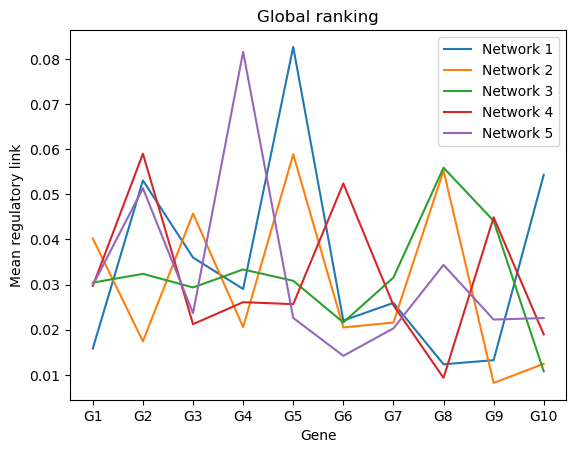
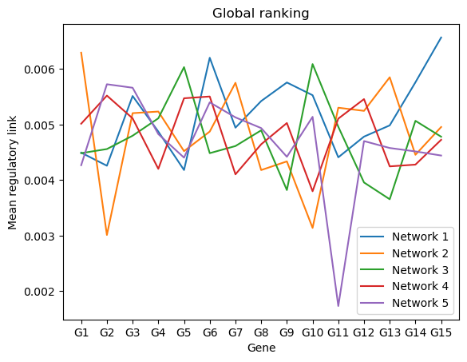
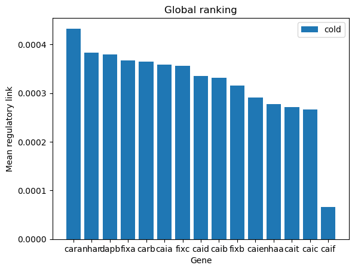

# (Reproduce Simpler)BiXGBoost & BiRandomForest: a scalable, flexible boosting based method for reconstructing gene regulatory networks
BiXGBoost is a bidirectional method that considers time information and integrates multi decision trees by the boosting method.

### Pip install
    scikit-learn Version
    Pandas
    Numpy

## Thanks to the following project
[BiXGBoost Repository](https://github.com/zrq0123/BiXGBoost/tree/master) 

## RESULTS
DREAM4 for output_insilico_size10 samples 5

DREAM4 for output_insilico_size100 samples 10

E.Coli for output_cold_time_3_replice cold environment samples 3

       
